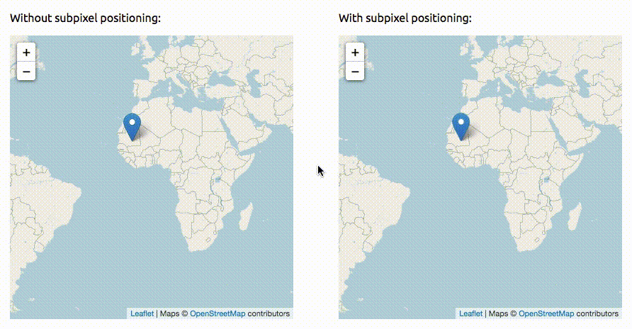

# Leaflet Subpixel Position

This leaflet plugin adds subpixel positioning methods for leaflet objects.



[Demo](https://itanka9.github.io/l-subpixel-position)

## Compatibility with Leaflet Versions

Compatible with the latest stable Leaflet version leaflet-1.5.

## Browser Compatibility

This plugin useful in webkit-based browsers. It is compatible but useless in Firefox, because it does not support displaying things with subpixels.

## Usage

Add this line to your HTML file after Leaflet:

```html
<script type="text/javascript" src="l-subpixel-position.js"></script>
```

Then add your first MovingMarker:

```js
var myMarker = L.Marker([48.8567, 2.3508]).addTo(map);

...
myMarker.setLatLngPrecise(latlng)
```

## API

Plugin adds `setLatLngPrecise` method to `L.Marker`:

| Method | Returns | Description |
| --- | --- | --- |
| `setLatLngPrecise(<`[LatLng](https://leafletjs.com/reference-1.6.0.html#latlng)`> latlng)` | this | Changes the marker position to the given point with subpixel accuracy. |

This method has the same behaviour as standard `setLatLng`.

## License

MIT

